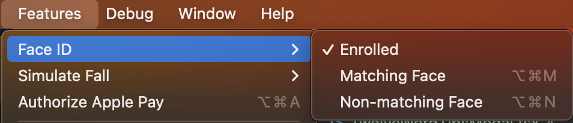

# ETH Wallet

An application that allows user to view ETH balance and address by twelve-word recovery seed.

## Installation

```
yarn install
yarn prepare
cd ios
pod install
```

`yarn prepare` is used to setup "husky" for eslint checking & testing(TODO) before every commit.

In other to make the intallation easier, key is stored in source code. However, hacker may obtain the key by reverse engineering. Therefore, key should store in server side rather than client side. Beside that, SSL pinning should be added to client side to protect the key from middle man attack.\n
Change `PROJECT_ID` in `./src/constants/KEYS.ts` to your own project id. You may get it for free from [infura](https://app.infura.io).

## Getting start

This project is created by React Native CLI. XCode and Android Studio are needed.

### iOS

1. Start XCode, open `./ios/ETHWallet.xcworkspace` (\*NOT ETHWallet.xcodeproj)
2. Run the project. (Short cut Command + R)

### Android

1. Start Android Studio, open folder `./android/`
2. Wait for Gradle sync until run button actived.
3. Run the project. (Short cut control + R)

If error `Error: Biometry is not enrolled` is occured, please enroll the face id/ touch id of iOS simulator.

and setup Fingerprint in android emulator.

## Testing

TODO: add unit test(jest) & end to end test(detox)

## Commit

if the following error occured during commit

```
.husky/pre-commit: line 4: yarn: command not found
```

run

```
yarn export-huskyrc
```
